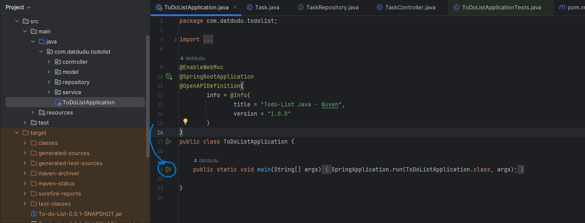

# Todo List Java Project

Este é um projeto Java criado no estilo Todo List, utilizando o Spring Framework, JPA, H2 e Lombok. O objetivo deste projeto é fornecer uma aplicação simples para gerenciar uma lista de tarefas.
Projeto feito no período de 3 dias, então muitas funcionalidades estão cruas e não há muitas validações.

## Requisitos

Certifique-se de ter instalado os seguintes requisitos antes de executar este projeto:

- Java Development Kit (JDK) versão 21 ou superior
- Maven
- Git (opcional)

## Como Executar:

1. Clone o repositório em sua máquina local:

```shell
git clone https://github.com/datdudu/todo-list-java.git 
```


Ou baixe o projeto como um arquivo zip e descompacte-o.

2. Navegue até o diretório do projeto:

```shell
cd ../todo-list-java
```

3. Compile o projeto usando o Maven:

```shell
mvn clean install
```

4. Vá até src/java/com.datdudu.todolist e execute a classe TodoListApplication


- Para executar os testes unitários da aplicação, utilize o comando:
```shell
mvn test
```

5. A aplicação estará disponível em `http://localhost:8080`.

6. Para acessar a documentação acesse `http://localhost:8080/swagger-ui/index.html`
- Documentação feita no swagger
- Para acessar a documentação em Markdown e os Endpoints clique aqui.

## Funcionalidades

- Adicionar uma nova tarefa
- Visualizar todas as tarefas
- Marcar uma tarefa como concluída
- Remover uma tarefa

## Tecnologias Utilizadas

- Spring Framework: para a configuração da aplicação e injeção de dependências. (Versão 3.2.3)
- JPA (Java Persistence API): para mapeamento objeto-relacional (ORM) e persistência de dados.
- H2 Database: banco de dados em memória para desenvolvimento e testes mais rapidamente
- Lombok: para reduzir a verbosidade do código Java.

